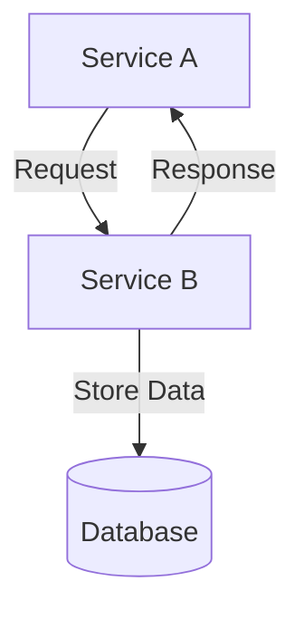

# AI.VC Platform Documentation

Welcome to the AI.VC platform documentation. This repository contains comprehensive documentation for the AI-driven investment decision support system.

## Documentation Structure

The documentation is organized into the following sections:

### Architecture Overview

[Architecture Documentation](./architecture.md) provides a comprehensive overview of the AI.VC platform architecture, detailing:

- System components and their interactions
- Core services and their responsibilities
- Infrastructure components
- Data flow patterns
- Development guidelines

### API Reference

[API Reference](./api_reference.md) provides detailed information about all API endpoints in the system:

- Authentication
- Service endpoints
- Request/response formats
- Error handling
- Rate limiting

### Operations Guide

[On-Call Playbook](./oncall.md) provides guidance for on-call engineers responding to alerts and incidents:

- Incident response process
- Common alert types and resolution steps
- Troubleshooting guides
- Escalation paths

[Observability Infrastructure](./observability.md) describes the monitoring and alerting infrastructure:

- Metrics collection with Prometheus
- Distributed tracing with Jaeger
- Alerting with Alertmanager
- Grafana dashboards

### Future Plans

[Future Roadmap](./future_roadmap.md) outlines planned developments and enhancements:

- Near-term enhancements (0-3 months)
- Medium-term vision (3-12 months)
- Long-term vision (12+ months)
- Technical roadmap and implementation approach

## Viewing Documentation

The documentation files are written in Markdown format with embedded Mermaid diagrams. You can view them in any Markdown viewer, or use the tools below:

### Using markserv (Development)

To view the documentation with a local web server:

```bash
npx markserv docs
```

The documentation will be available at [http://localhost:8642](http://localhost:8642)

### Using mdocs (Production)

For a more polished documentation website:

```bash
# Install mdocs if not already installed
npm install mdocs

# Start the documentation server
npx mdocs dev
```

The documentation will be available at [http://localhost:3000](http://localhost:3000)

## Contributing to Documentation

When contributing to documentation, please follow these guidelines:

1. Use clear, concise language that is accessible to both technical and non-technical readers
2. Include descriptive diagrams using Mermaid syntax when appropriate
3. Follow consistent formatting for API endpoints, code examples, and configuration snippets
4. Update diagrams when system architecture changes
5. Include runbook entries for new alert types

## Diagram Support

This documentation uses Mermaid for diagrams. Here's an example:



Mermaid supports various diagram types:
- Flowcharts
- Sequence diagrams
- Class diagrams
- Entity-relationship diagrams
- State diagrams
- Gantt charts