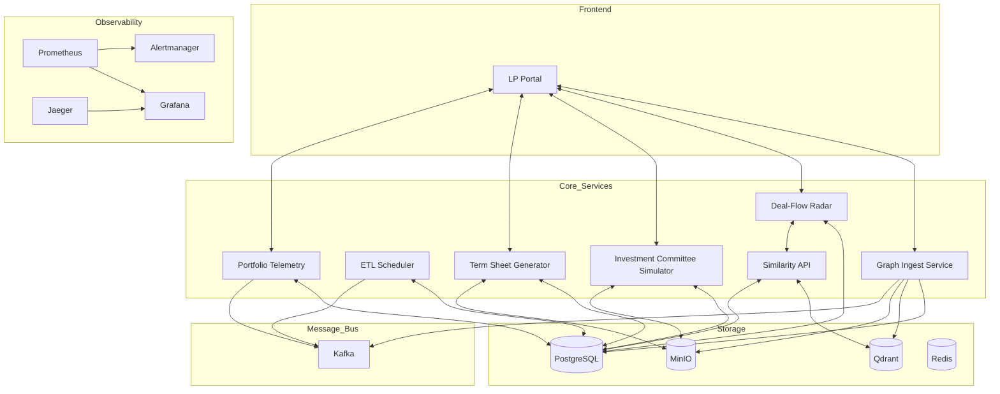
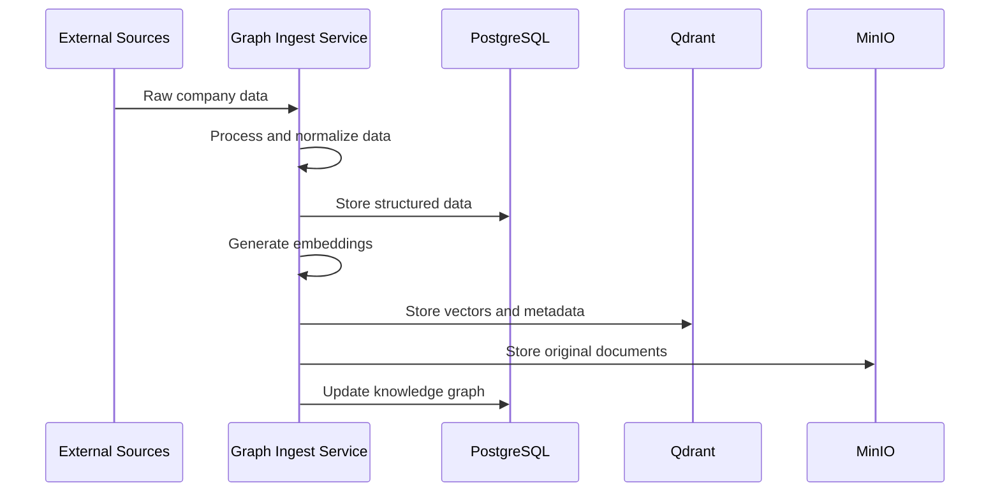
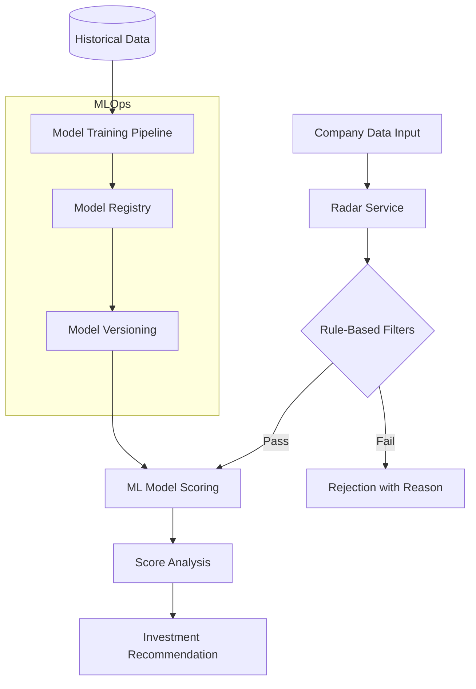
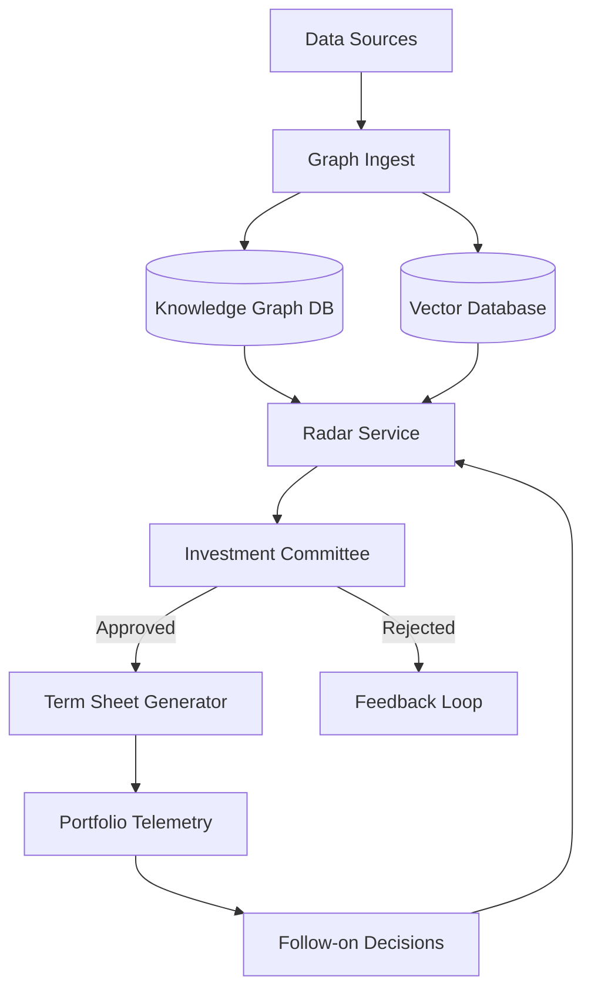
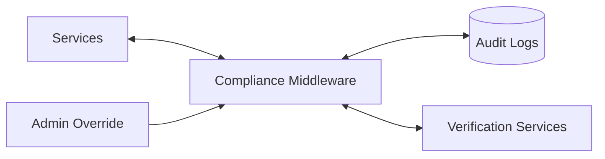
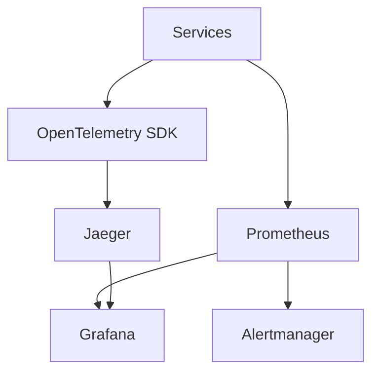

# AI.VC Platform Architecture

## Overview

The AI.VC platform is designed as a comprehensive investment decision support system combining rule-based filtering with advanced AI analysis techniques. This document outlines the high-level architecture, service interactions, and data flows within the platform.

## System Architecture

The platform is built as a microservices architecture following a polylith pattern with these key directories:
- `/services`: Contains all microservices
- `/libs`: Shared libraries used across services
- `/infra`: Infrastructure configuration 
- `/docs`: Documentation



## Services Description

### 1. Data Ingestion & Knowledge Graph Service
- Ingests company data from multiple sources 
- Creates graph representation of companies and relationships
- Extracts features for the Radar model
- Stores documents in MinIO
- Pushes vectorized content to Qdrant



### 2. Event-Driven ETL Scheduler
- Manages recurring data processing jobs
- Orchestrates cross-service workflows
- Handles data transformation tasks
- Uses Kafka for reliable messaging

### 3. Vectorizer & Similarity API
- Provides vector search capabilities
- Handles semantic search requests
- Manages embedding models
- Services similarity queries for other components

### 4. Deal-Flow Radar (Scoring Service)
- Predicts company success probability
- Utilizes ML models with MLflow tracking
- Auto-retrains on new data
- Implements cost guardrails and rate limiting



### 5. Investment Committee Simulator
- Two-stage decision process
- Rule-based filtering for initial qualification
- LLM-based analysis using Tree-of-Thought reasoning
- Audit logging for all decisions

### 6. Term-Sheet Generator & Negotiator Bot
- Generates legal documents based on NVCA templates
- Provides real-time negotiation capabilities
- Includes Slack integration for extreme counter-offers
- WebSocket interface for interactive negotiations

### 7. Portfolio Telemetry Service
- Monitors portfolio company performance
- Triggers follow-on investment decisions
- Runway and growth-based analysis
- Uses APScheduler for periodic assessment

### 8. Frontend LP Portal
- Next.js 14 web interface
- tRPC for type-safe API calls
- Theme provider for light/dark mode
- Interactive dashboards for portfolio monitoring

## Technology Stack

| Component | Technology |
|-----------|------------|
| Backend Services | Python 3.11, FastAPI |
| Frontend | Next.js 14, TypeScript |
| Database | PostgreSQL 16 |
| Vector Store | Qdrant |
| Object Storage | MinIO |
| Message Broker | Kafka |
| Caching | Redis |
| ML Framework | scikit-learn, MLflow |
| AI Models | OpenAI GPT-4o |
| Tracing | Jaeger, OpenTelemetry |
| Metrics | Prometheus, Grafana |
| Alerting | Alertmanager |

## Data Flow Architecture

The following diagram illustrates the primary data flows through the system:



## Compliance and Security Layer

All services interact with a common compliance middleware that provides:
- Investor accreditation verification
- OFAC sanctions checking
- Decision payload hashing
- Append-only audit logs
- Kill-switch admin overrides



## Observability Infrastructure

The platform includes comprehensive observability with:
- Distributed tracing through OpenTelemetry and Jaeger
- Metrics collection with Prometheus
- Visualization dashboards in Grafana
- Alerts via Alertmanager
- Detailed token usage monitoring for OpenAI costs



## Development Environment

The development environment can be started with:
```bash
make dev  # Start all services
make observability  # Start the observability stack
```

## Deployment Model

The system is designed to be deployed in a Kubernetes environment with:
- Horizontal scaling for stateless services
- High availability configurations for databases
- Resource quotas and cost guardrails
- GitOps-based deployment pipeline