# AI.VC Platform Architecture

This document provides a comprehensive overview of the AI.VC platform architecture, detailing the system components, data flows, and integration points.

## System Overview

AI.VC is an advanced AI-driven investment decision support system that combines sophisticated rule-based filtering with intelligent analysis techniques. The platform is designed to help venture capital firms streamline their investment process, from deal sourcing to portfolio monitoring.

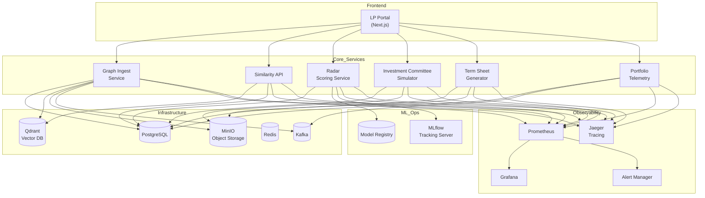

## Architecture Principles

The AI.VC platform follows these core architectural principles:

1. **Microservices Architecture**: The system is decomposed into specialized services that focus on specific business capabilities.
2. **Event-Driven Design**: Services communicate via events for asynchronous processing of long-running tasks.
3. **Polyglot Persistence**: Different data storage technologies are used based on the specific requirements of each service.
4. **AI-First Approach**: Machine learning and AI capabilities are integrated throughout the platform, not as bolt-on features.
5. **Observability by Design**: Comprehensive monitoring, tracing, and alerting are built into all services.
6. **Security and Compliance**: Regulatory requirements are addressed through purpose-built compliance middleware.

## Core Services

### 1. Graph Ingest Service

The Graph Ingest Service handles all data ingestion into the AI.VC platform, creating structured data and knowledge graphs from various sources.

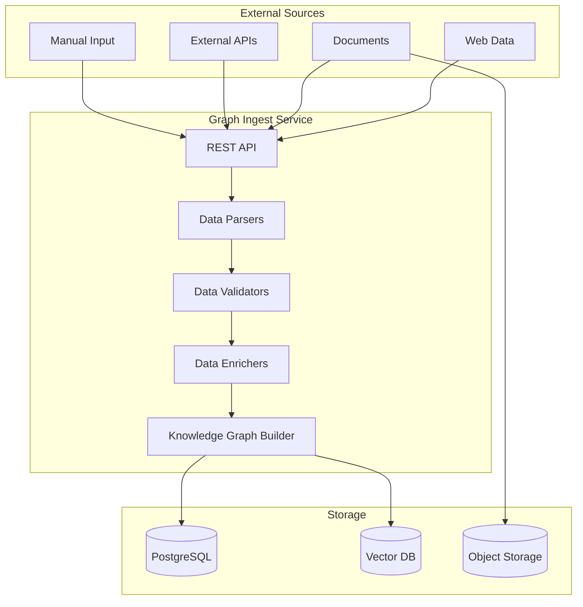

**Key Features**:
- Multi-format ingestion (spreadsheets, PDFs, web data)
- Automatic entity extraction and linking
- Knowledge graph construction
- Data validation and enrichment

### 2. Similarity API

The Similarity API provides vector search capabilities over companies, documents, and other entities in the system.

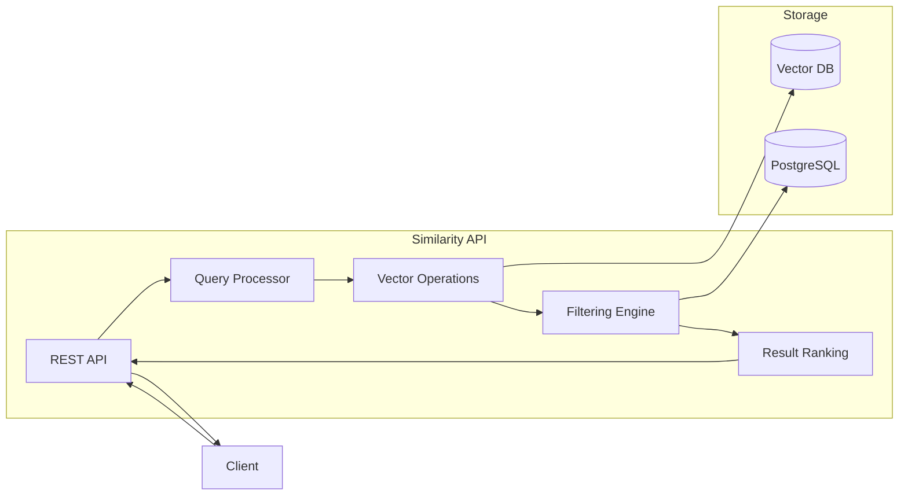

**Key Features**:
- Semantic search across portfolios and companies
- Hybrid ranking (vector similarity + metadata filtering)
- Multi-modal search (text, numerical data, graphs)
- Configurable similarity thresholds

### 3. Deal-Flow Radar Service

The Radar service provides algorithmic scoring and filtering of potential investments.

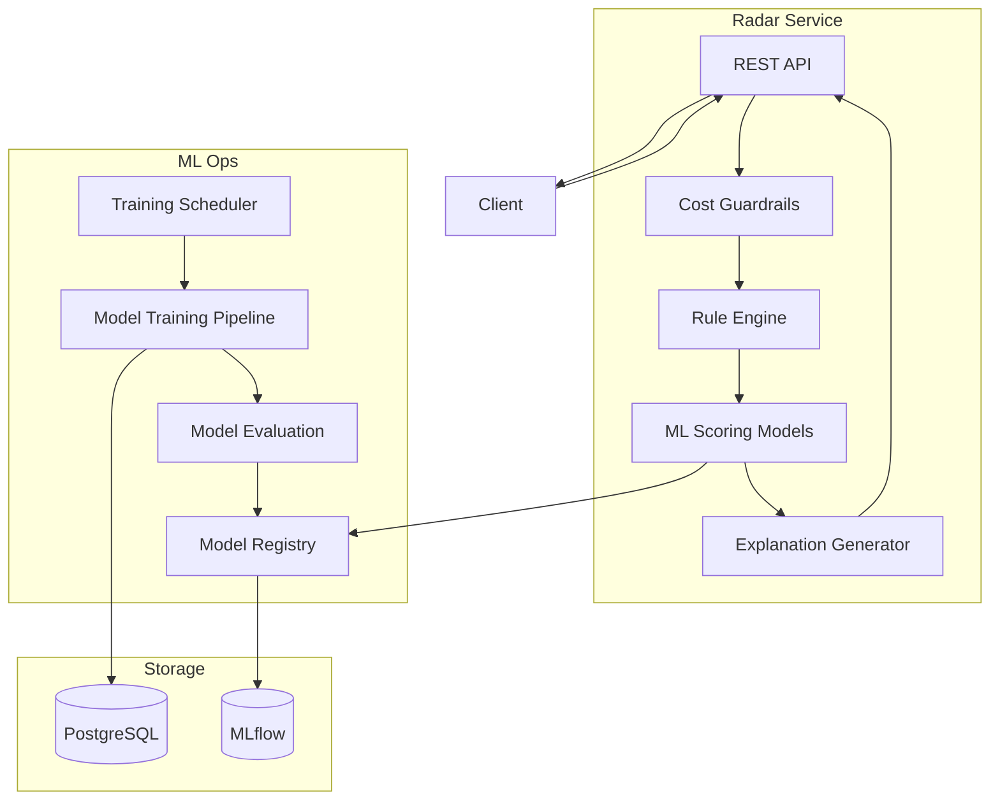

**Key Features**:
- Two-stage filtering (rules + ML models)
- Explainable AI for investment recommendations
- Automatic model retraining with performance monitoring
- Cost guardrails for API usage

### 4. Investment Committee Simulator

The Investment Committee Simulator provides automated investment decisions with detailed reasoning.

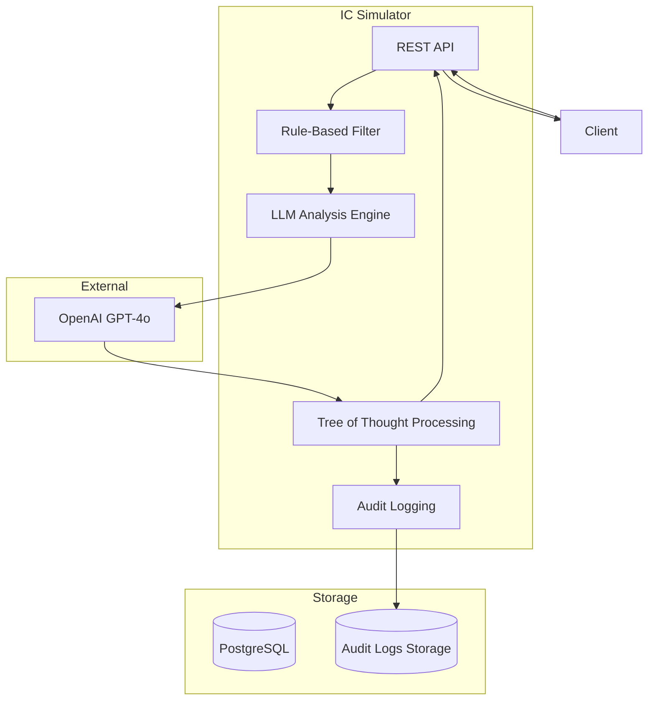

**Key Features**:
- Two-stage decision process (rule filter + LLM analysis)
- Tree of Thought investment reasoning
- Detailed chain-of-thought documentation
- Audit trail for compliance

### 5. Term Sheet Generator & Negotiator

The Term Sheet Generator produces legal documents and handles term negotiation.

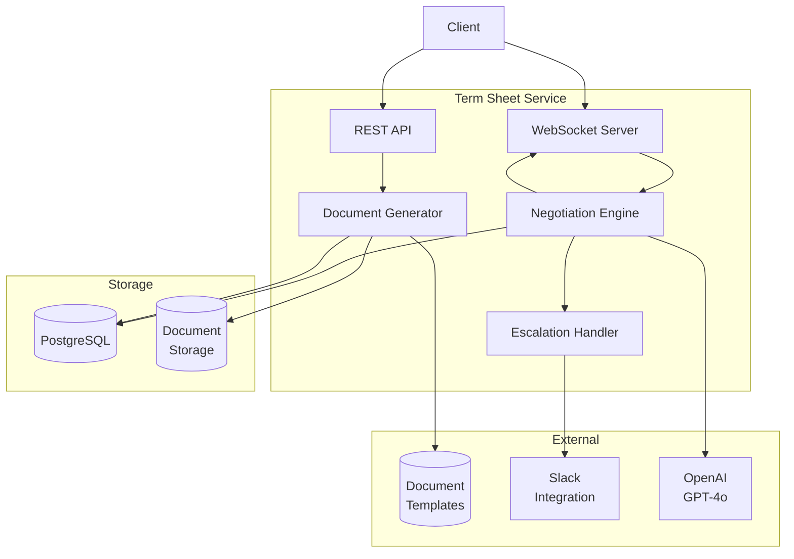

**Key Features**:
- NVCA-compliant document generation
- Real-time negotiation via WebSockets
- LLM-powered negotiation assistant
- Extreme counter-offer detection and escalation

### 6. Portfolio Telemetry Service

The Portfolio Telemetry Service tracks company performance metrics and identifies follow-on investment opportunities.

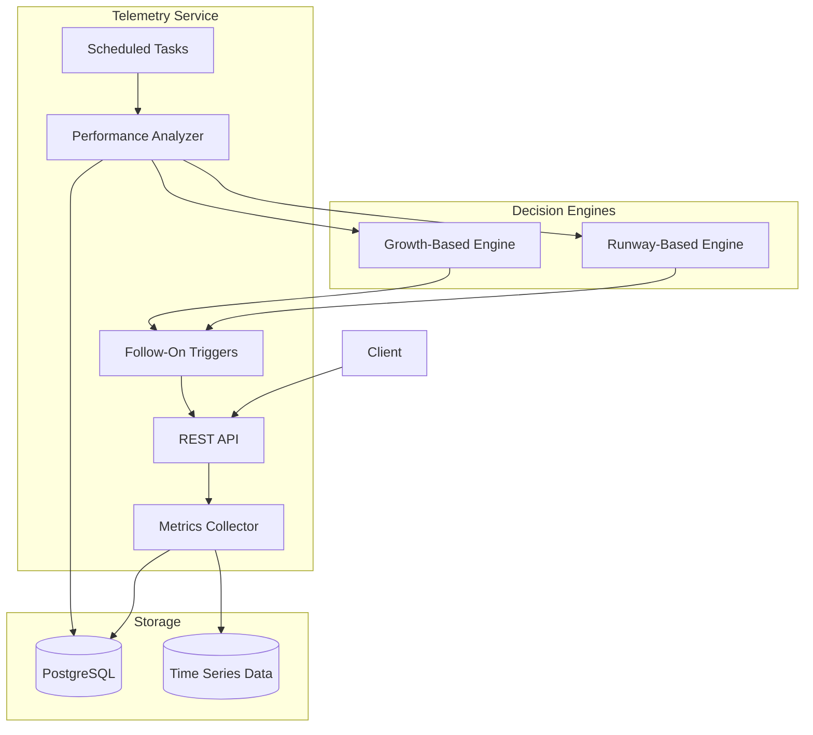

**Key Features**:
- Automated data collection from portfolio companies
- Time-series tracking of key financial metrics
- Runway-based and growth-based follow-on triggers
- Portfolio health monitoring dashboard

### 7. Scheduler Service

The Scheduler Service manages recurring tasks and ETL workflows.

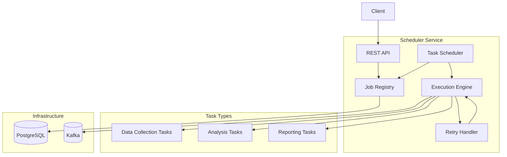

**Key Features**:
- Cron-style scheduling of recurring tasks
- Event-driven task execution
- Retry logic with configurable backoff
- Task history and audit logging

## Infrastructure Components

### PostgreSQL Database

PostgreSQL serves as the primary relational database for the AI.VC platform:

- **Companies Table**: Core company information, financial data, and investment details
- **Deals Table**: Information about investment deals, terms, and statuses
- **Users Table**: User accounts, roles, and permissions
- **Audit Log Table**: Append-only audit log for compliance purposes
- **Metrics Table**: Time-series data for company performance tracking

### Qdrant Vector Database

Qdrant provides vector search capabilities for similarity matching:

- **Company Vectors**: Embeddings of company descriptions, business models, and pitches
- **Document Vectors**: Embeddings of documents, sections, and key paragraphs
- **Market Vectors**: Embeddings of market descriptions and trends
- **Founder Vectors**: Embeddings of founder profiles and backgrounds

### MinIO Object Storage

MinIO serves as the object storage solution for:

- **Documents**: Company pitch decks, financial models, and legal documents
- **AI Analysis Logs**: Complete logs of LLM-based analyses with chain-of-thought details
- **Generated Documents**: Term sheets, investment memos, and reports
- **Backups**: Database backups and configuration snapshots

### Redis

Redis provides in-memory storage for:

- **Caching**: API response caching and query result caching
- **Rate Limiting**: Tracking request counts for API rate limiting
- **Session Management**: User session data
- **Job Queues**: Lightweight task queues for background processing

### Kafka

Kafka enables event-driven communication between services:

- **Data Ingestion Events**: Notifications about new data being ingested
- **Analysis Events**: Triggers for analysis tasks based on new data
- **Follow-On Triggers**: Events related to potential follow-on investment opportunities
- **Compliance Events**: Events related to compliance checks and verifications

## ML & AI Components

### MLflow

MLflow provides tracking and management for machine learning:

- **Experiment Tracking**: Tracking of model training experiments
- **Model Registry**: Central repository for trained models
- **Model Versioning**: Versioning and promotion of models to production
- **Parameter Tracking**: Tracking of hyperparameters and training metrics

### OpenAI Integration

The platform integrates with OpenAI's models for:

- **Investment Analysis**: Tree-of-thought analysis of investment opportunities
- **Term Negotiation**: Assistance with term sheet negotiation
- **Document Analysis**: Extraction of key information from documents
- **Summarization**: Generation of executive summaries and reports

### Cost Guardrails

Cost control mechanisms for AI usage:

- **Rate Limiting**: Limits on the number of requests per time period
- **Token Metering**: Tracking and limiting of token usage
- **Batch Processing**: Batching of requests to optimize token usage
- **Fallback Strategies**: Less expensive alternatives for non-critical tasks

## Observability Stack

### Prometheus

Prometheus collects metrics from all services:

- **System Metrics**: CPU, memory, disk, and network usage
- **Application Metrics**: Request counts, error rates, and latencies
- **Business Metrics**: Investment volumes, deal flow, and portfolio performance
- **AI Metrics**: Token usage, model performance, and inference times

### Grafana

Grafana provides visualization of metrics and data:

- **Service Dashboards**: Real-time monitoring of service health
- **Token Usage Dashboards**: Tracking of AI token consumption
- **Investment Dashboards**: Visualizations of investment performance
- **Alert Dashboards**: Overview of triggered alerts and their statuses

### Jaeger

Jaeger enables distributed tracing:

- **Request Tracing**: End-to-end tracing of requests across services
- **Performance Analysis**: Identification of bottlenecks and performance issues
- **Error Tracking**: Tracing of error propagation across services
- **Dependency Mapping**: Visualization of service dependencies

### Alert Manager

Alert Manager handles alerting based on metric thresholds:

- **Service Alerts**: Notifications about service health issues
- **Cost Alerts**: Alerts for unusual token usage or cost spikes
- **Performance Alerts**: Notifications about performance degradation
- **Business Alerts**: Alerts related to investment opportunities or risks

## Security & Compliance Layer

### Investor Accreditation Verification

Ensures compliance with SEC regulations for accredited investors:

- **Verification API**: Interface for verifying investor accreditation status
- **Document Storage**: Secure storage of accreditation documentation
- **Renewal Tracking**: Monitoring of accreditation expiration dates
- **Audit Logs**: Records of all accreditation checks

### OFAC Sanctions Checking

Ensures compliance with sanctions regulations:

- **Name Screening**: Checking of names against sanctions lists
- **Risk Scoring**: Risk assessment based on name matches
- **False Positive Handling**: Processes for resolving false positives
- **Documentation**: Records of all sanctions checks

### Decision Payload Hashing

Ensures integrity of investment decisions:

- **SHA-256 Hashing**: Generation of secure hashes for decision payloads
- **Immutable Storage**: Storage of hashes in an append-only log
- **Verification API**: Interface for verifying decision integrity
- **Tamper Detection**: Mechanisms for detecting manipulation attempts

### Admin Override Functionality

Provides supervised exceptions to automated compliance checks:

- **Kill-Switch API**: Interface for overriding compliance checks
- **Role-Based Authorization**: Restriction of override capabilities to GPs
- **Audit Logging**: Detailed logging of all override actions
- **Justification Requirements**: Mandatory documentation of override reasons

## Data Flow Patterns

### Deal Sourcing Flow

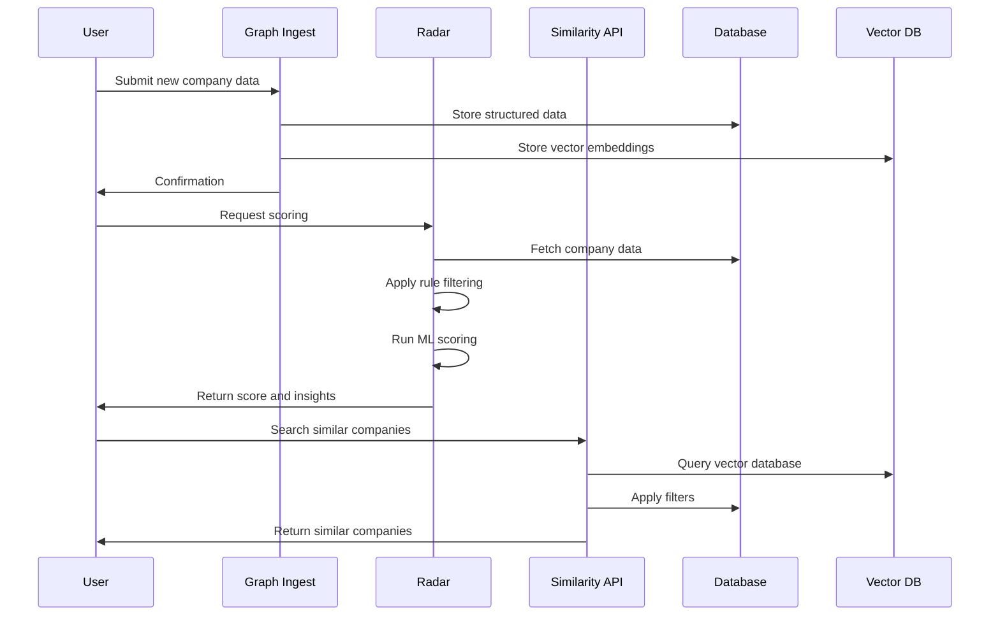

### Investment Decision Flow

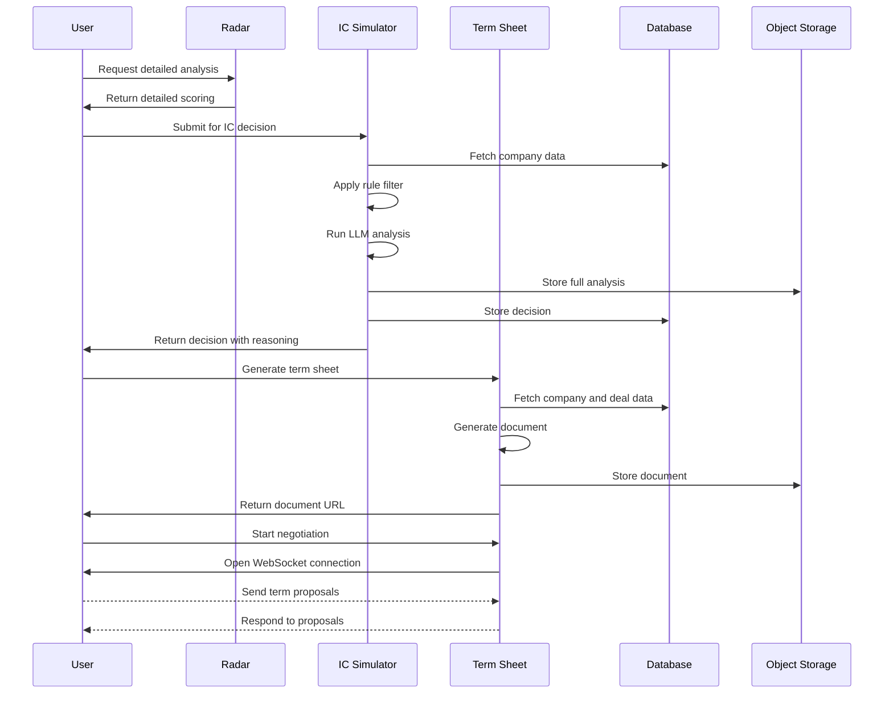

### Portfolio Monitoring Flow

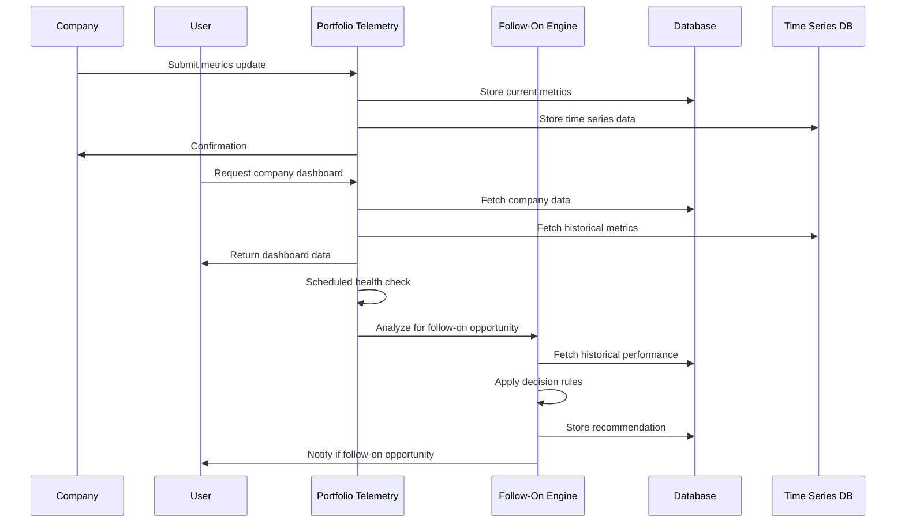

## Deployment Architecture

The AI.VC platform is deployed using a containerized infrastructure with Docker for development and Kubernetes for production environments.

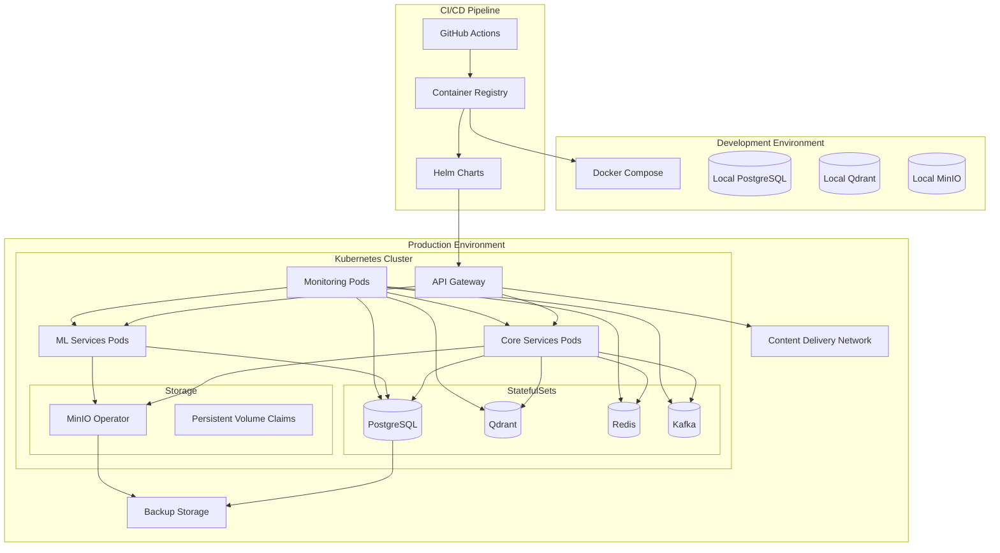

## Development Guidelines

### Code Organization

The codebase follows a monorepo structure with the polylith folder pattern:

- **/services**: Service implementations
- **/libs**: Shared libraries
- **/infra**: Infrastructure configuration
- **/docs**: Documentation
- **/scripts**: Utility scripts
- **/tests**: Tests for shared components

### Tech Stack

- **Backend**: Python 3.11 with FastAPI
- **Frontend**: TypeScript with Next.js 14
- **Data Storage**: PostgreSQL 16, Qdrant, MinIO, Redis
- **Message Broker**: Kafka
- **ML Ops**: MLflow, Scikit-learn, PyTorch
- **Observability**: Prometheus, Grafana, Jaeger
- **DevOps**: Docker, Kubernetes, GitHub Actions
- **Documentation**: Markdown, Mermaid diagrams

### API Design Principles

- RESTful API design with consistent patterns
- OpenAPI/Swagger documentation for all endpoints
- JWT-based authentication and authorization
- Standardized error responses and status codes
- Rate limiting and throttling for all public endpoints

### Testing Strategy

- Unit tests for all business logic
- Integration tests for service interactions
- E2E tests for critical user flows
- Performance testing for high-volume endpoints
- Security testing for authentication and authorization

## Conclusion

The AI.VC platform architecture is designed to provide a comprehensive investment decision support system with a focus on AI-driven analysis, compliance, and portfolio monitoring. The microservices approach allows for independent scaling and evolution of components, while the shared infrastructure ensures consistency and reliability across the platform.