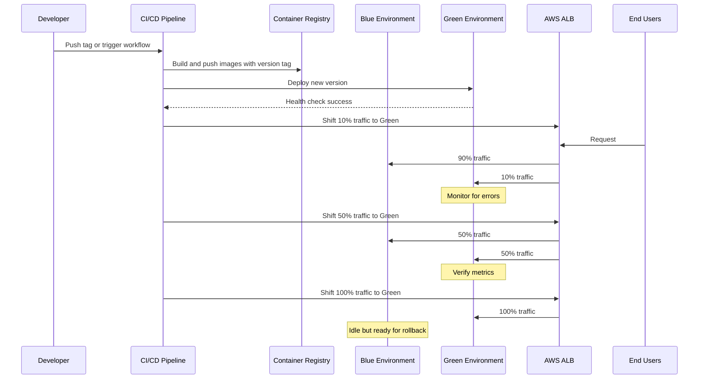

# AI.VC Platform Disaster Recovery Runbook

## Table of Contents

1. [Introduction](#introduction)
2. [Architecture Overview](#architecture-overview)
3. [Backup Strategy](#backup-strategy)
4. [Blue/Green Deployment Process](#bluegreen-deployment-process)
5. [Disaster Recovery Procedures](#disaster-recovery-procedures)
   - [Service Outage](#service-outage)
   - [Database Failure](#database-failure)
   - [Region Failure](#region-failure)
   - [Data Corruption](#data-corruption)
6. [Rollback Procedures](#rollback-procedures)
7. [Testing and Validation](#testing-and-validation)
8. [Contact Information](#contact-information)

## Introduction

This document serves as a comprehensive guide for disaster recovery procedures for the AI.VC Platform. It outlines the steps to recover from various types of failures, including service outages, database failures, and regional failures.

## Architecture Overview

The AI.VC Platform consists of the following core components:

- **Frontend Service**: Next.js web application
- **Backend API Service**: FastAPI-based REST API
- **Specialized Services**: Radar, Graph Ingest, IC Simulator, Term Sheet, etc.
- **PostgreSQL Database**: Persistent data storage
- **Redis**: Caching and temporary data storage
- **S3/MinIO**: Object storage for files and artifacts
- **Kubernetes**: Container orchestration on EKS
- **AWS ALB**: Load balancing with blue/green deployment capability

## Backup Strategy

### Database Backups

- **RDS Automated Backups**: Automated daily snapshots with 7-day retention
- **Backup Window**: 03:00-05:00 UTC daily (low traffic period)
- **Manual Snapshots**: Additional manual snapshots before major changes
- **Point-in-Time Recovery**: Available within the 7-day backup window

### Object Storage Backups

- **S3 Versioning**: All objects in S3 are versioned
- **Cross-Region Replication**: Production S3 buckets are replicated to a secondary region (us-east-1)
- **Lifecycle Rules**: 
  - Non-current versions transition to STANDARD_IA after 14 days
  - Non-current versions transition to GLACIER after 30 days
  - Non-current versions expire after 90 days

### Configuration Backups

- **Infrastructure as Code**: All infrastructure defined in Pulumi code
- **Version Control**: All infrastructure code stored in Git repository
- **State File**: Pulumi state securely stored with regular backups

## Blue/Green Deployment Process

Blue/Green deployment enables zero-downtime releases by running two separate environments (blue and green) and switching traffic between them.

### Deployment Sequence



### Traffic Shifting Process

1. Deploy new version to green environment
2. Run health checks against green environment
3. Gradually shift traffic:
   - 10% to green, 90% to blue (initial canary)
   - 50% to green, 50% to blue (equal split)
   - 100% to green, 0% to blue (complete cutover)
4. Keep blue environment ready for quick rollback
5. On next deployment, the roles swap (green becomes blue)

## Disaster Recovery Procedures

### Service Outage

#### Frontend/Backend Service Failure

1. **Identify the issue**: Check logs in CloudWatch Logs, Grafana, or Kubernetes logs
   ```bash
   kubectl logs -n aivc deployment/frontend-blue
   kubectl logs -n aivc deployment/backend-blue
   ```

2. **Check deployment status**:
   ```bash
   kubectl get pods -n aivc
   kubectl describe deployment/frontend-blue -n aivc
   ```

3. **If green environment is healthy, shift traffic**:
   ```bash
   aws elbv2 modify-listener --listener-arn <frontend-listener-arn> --default-actions Type=forward,TargetGroupArn=<frontend-green-tg-arn>
   aws elbv2 modify-rule --rule-arn <api-rule-arn> --actions Type=forward,TargetGroupArn=<api-green-tg-arn>
   ```

4. **If both environments are unhealthy, rollback to last known good version**:
   ```bash
   kubectl rollout undo deployment/frontend-blue -n aivc
   kubectl rollout undo deployment/backend-blue -n aivc
   ```

5. **Scale up resources if needed**:
   ```bash
   kubectl scale deployment/frontend-blue -n aivc --replicas=4
   kubectl scale deployment/backend-blue -n aivc --replicas=4
   ```

### Database Failure

#### RDS Instance Failure

1. **Check RDS status**:
   ```bash
   aws rds describe-db-instances --db-instance-identifier aivc-prod-postgres
   ```

2. **For Multi-AZ Setup**: Automatic failover to standby instance should occur
   - Monitor failover process in AWS Console or with CLI:
     ```bash
     aws rds describe-events --source-identifier aivc-prod-postgres --source-type db-instance
     ```

3. **If no automatic failover, initiate manual failover**:
   ```bash
   aws rds reboot-db-instance --db-instance-identifier aivc-prod-postgres --force-failover
   ```

4. **If instance is corrupted, restore from snapshot**:
   ```bash
   # List available snapshots
   aws rds describe-db-snapshots --db-instance-identifier aivc-prod-postgres
   
   # Restore from snapshot
   aws rds restore-db-instance-from-db-snapshot \
     --db-instance-identifier aivc-prod-postgres-restored \
     --db-snapshot-identifier <snapshot-id> \
     --db-subnet-group-name aivc-prod-postgres-subnet-group
   ```

5. **Update database connection string if needed**:
   ```bash
   kubectl create secret generic db-credentials --namespace aivc \
     --from-literal=database-url="<new_connection_string>" \
     --dry-run=client -o yaml | kubectl apply -f -
   
   kubectl rollout restart deployment -n aivc
   ```

### Region Failure

In case of a complete AWS region failure:

1. **Activate cross-region recovery**:
   - Access AWS console or CLI from a working region
   - Switch to DR region (us-east-1)

2. **Restore database from the latest automated backup**:
   ```bash
   aws rds restore-db-instance-from-db-snapshot \
     --db-instance-identifier aivc-dr-postgres \
     --db-snapshot-identifier <latest-snapshot-id> \
     --availability-zone us-east-1a \
     --db-subnet-group-name aivc-dr-subnet-group
   ```

3. **Deploy application stack in DR region**:
   ```bash
   cd infra/pulumi
   pulumi stack init dr
   pulumi config set aws:region us-east-1
   pulumi up
   ```

4. **Update DNS to point to DR environment**:
   ```bash
   aws route53 change-resource-record-sets \
     --hosted-zone-id <zone-id> \
     --change-batch '{"Changes":[{"Action":"UPSERT","ResourceRecordSet":{"Name":"aivc-platform.com","Type":"A","AliasTarget":{"HostedZoneId":"Z35SXDOTRQ7X7K","DNSName":"<dr-alb-dns-name>","EvaluateTargetHealth":true}}}]}'
   ```

### Data Corruption

1. **Identify the corruption scope**:
   - Isolated to specific tables/records
   - Widespread across the database

2. **For isolated corruption**:
   - Use database transaction logs to identify corrupted data
   - Restore specific tables or records from backups
   
   ```sql
   -- Create temporary table
   CREATE TABLE temp_restored_table AS SELECT * FROM corrupted_table;
   
   -- Import data from backup
   -- Follow database-specific procedure
   
   -- Update corrupted records
   UPDATE corrupted_table SET column = temp_restored_table.column 
   FROM temp_restored_table
   WHERE corrupted_table.id = temp_restored_table.id;
   ```

3. **For widespread corruption**:
   - Perform full database restore
   - Use point-in-time recovery to restore to a moment before corruption
   ```bash
   aws rds restore-db-instance-to-point-in-time \
     --source-db-instance-identifier aivc-prod-postgres \
     --target-db-instance-identifier aivc-prod-postgres-restored \
     --restore-time "2025-04-23T10:00:00Z"
   ```

## Rollback Procedures

### Rolling Back a Deployment

1. **Shift traffic back to blue environment**:
   ```bash
   aws elbv2 modify-listener --listener-arn <frontend-listener-arn> --default-actions Type=forward,TargetGroupArn=<frontend-blue-tg-arn>
   aws elbv2 modify-rule --rule-arn <api-rule-arn> --actions Type=forward,TargetGroupArn=<api-blue-tg-arn>
   ```

2. **Verify services are healthy**:
   ```bash
   kubectl get pods -n aivc -l color=blue
   kubectl get events -n aivc
   ```

3. **Scale down green environment if needed**:
   ```bash
   kubectl scale deployment/frontend-green -n aivc --replicas=0
   kubectl scale deployment/backend-green -n aivc --replicas=0
   ```

4. **Document rollback reason for future reference**

### Database Rollback

1. **Restore from snapshot or point-in-time recovery**:
   ```bash
   aws rds restore-db-instance-to-point-in-time \
     --source-db-instance-identifier aivc-prod-postgres \
     --target-db-instance-identifier aivc-prod-postgres-restored \
     --use-latest-restorable-time
   ```

2. **Update connection strings**:
   ```bash
   kubectl create secret generic db-credentials --namespace aivc \
     --from-literal=database-url="<restored_connection_string>" \
     --dry-run=client -o yaml | kubectl apply -f -
   ```

3. **Restart services**:
   ```bash
   kubectl rollout restart deployment -n aivc
   ```

## Testing and Validation

### Regular Disaster Recovery Testing

1. **Quarterly DR simulations**:
   - Full restoration test from backups
   - Blue/green deployment testing
   - Regional failover testing

2. **Backup verification**:
   - Weekly test restoration of database backups
   - Verification of data integrity

3. **Failover testing**:
   - Regular testing of Multi-AZ failover for RDS
   - Traffic shifting exercises for ALB

### Post-Recovery Validation

1. **Health checks**:
   - Verify all services are running
   - Check API endpoints are responding correctly
   - Validate database connectivity

2. **Data integrity checks**:
   - Run validation queries against database
   - Verify critical records are intact

3. **Performance testing**:
   - Compare performance metrics with baselines
   - Check for any degradation after recovery

## Contact Information

| Role | Name | Contact |
|------|------|---------|
| SRE Lead | [Name] | [Email/Phone] |
| Database Admin | [Name] | [Email/Phone] |
| Infrastructure Lead | [Name] | [Email/Phone] |
| Security Officer | [Name] | [Email/Phone] |
| AWS Support | N/A | [Support Portal URL] |