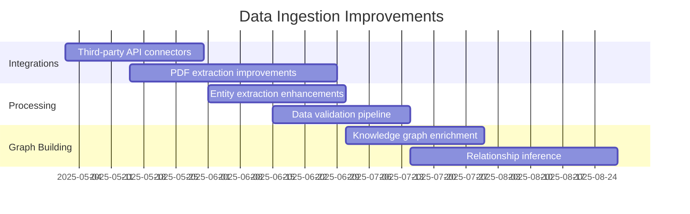
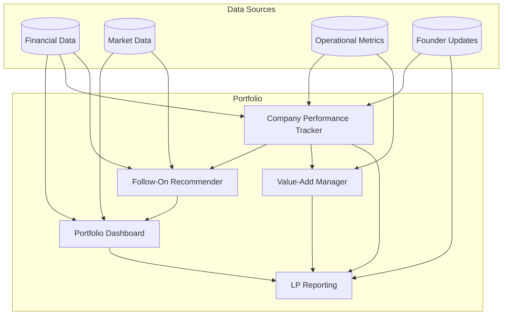
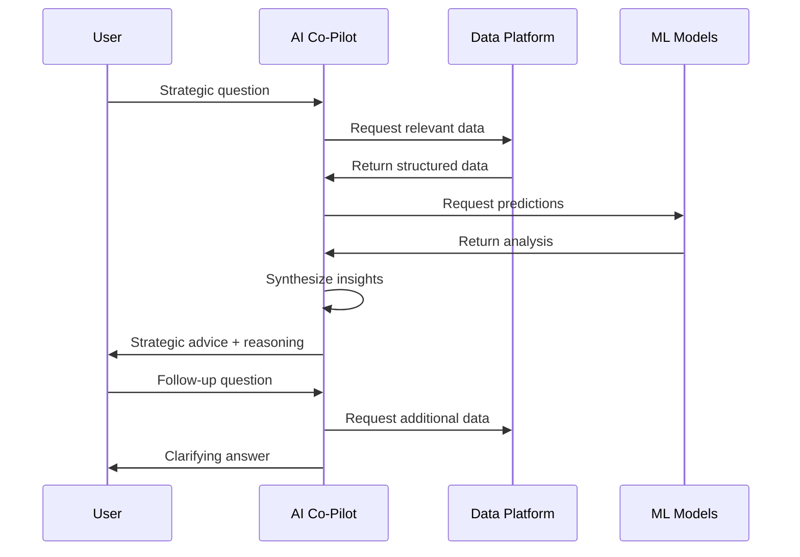

# Future Roadmap

This document outlines the planned future developments for the AI.VC platform.

## Near-Term Enhancements (0-3 Months)

### Improve Data Ingestion



1. **API Integrations**
   - Add integrations with PitchBook and Crunchbase for company data
   - Develop connectors for financial data providers
   - Create API for bulk data import from spreadsheets

2. **Document Processing**
   - Enhance PDF extraction capabilities for pitch decks
   - Improve table and chart detection in financial models
   - Add support for processing cap tables

3. **Knowledge Graph**
   - Expand entity types in knowledge graph
   - Improve relationship inference between entities
   - Add temporal dimension to track changes over time

### Enhance ML Model Performance

1. **Feature Engineering**
   - Add new features based on founder background
   - Create composite metrics for market potential
   - Develop time-series features for growth trajectories

2. **Model Architecture**
   - Experiment with ensemble methods
   - Implement attention mechanisms for company descriptions
   - Add multi-modal inputs (text + financial metrics)

3. **Evaluation Framework**
   - Develop backtesting framework for model evaluation
   - Create benchmark datasets for VC investment decisions
   - Implement A/B testing infrastructure for model comparison

### Improve User Experience

1. **Personalization**
   - User preference profiles for investment criteria
   - Personalized dashboards based on role and interests
   - Custom alert thresholds for portfolio companies

2. **Accessibility**
   - Mobile-responsive design for all interfaces
   - Keyboard shortcuts for power users
   - Screen reader compatibility

3. **Notifications**
   - Multi-channel notification system (email, Slack, in-app)
   - Customizable notification preferences
   - Digest mode for batched updates

## Medium-Term Vision (3-12 Months)

### Portfolio Management Suite



1. **Comprehensive Tracking**
   - Real-time financial metric tracking
   - Milestone achievement monitoring
   - Comparison with sector benchmarks

2. **Proactive Value-Add**
   - Automated identification of company needs
   - Matching with resources in investor network
   - Impact measurement of value-add activities

3. **LP Reporting**
   - Automated LP report generation
   - Interactive dashboards for LPs
   - Custom views based on LP interests

### Multi-Stage Investment Support

1. **Pre-Seed/Seed Evaluation**
   - Founder team analysis
   - Problem/solution fit assessment
   - Market opportunity sizing

2. **Series A/B Analysis**
   - Product-market fit metrics
   - Growth trajectory modeling
   - Competitive positioning analysis

3. **Growth Stage Evaluation**
   - Unit economics deep dive
   - Efficiency metrics analysis
   - Path to profitability modeling

### Enhanced Collaboration Features

1. **Team Collaboration**
   - Multi-user annotations and comments
   - Collaborative due diligence workflows
   - Version tracking for investment memos

2. **Ecosystem Collaboration**
   - Syndicate management tools
   - Co-investor communication platform
   - Founder-investor shared workspaces

3. **External Expert Integration**
   - Domain expert network integration
   - Third-party due diligence integration
   - External data provider marketplace

## Long-Term Vision (12+ Months)

### Market Intelligence Platform

1. **Trend Analysis**
   - Emerging technology trend detection
   - Market sentiment analysis
   - Funding environment forecasting

2. **Competitive Intelligence**
   - Competitive landscape mapping
   - Funding event impact analysis
   - M&A activity monitoring

3. **Macro Factor Modeling**
   - Economic indicator impact modeling
   - Regulatory change impact analysis
   - Cross-border investment opportunity identification

### Advanced LLM Integration



1. **AI Co-Pilot for Investors**
   - Investment thesis co-development
   - Strategic portfolio construction assistance
   - Market entry timing recommendations

2. **Autonomous Due Diligence**
   - Self-directed information gathering
   - Automatic inconsistency detection
   - Proactive risk identification

3. **Predictive Founder Success**
   - Founder personality trait analysis
   - Team complementarity assessment
   - Execution capability prediction

### Ecosystem Expansion

1. **Founder Tools**
   - Investor matching recommendations
   - Term sheet negotiation assistant
   - Cap table optimization

2. **LP Tools**
   - GP selection assistant
   - Portfolio construction recommendations
   - Performance attribution analysis

3. **Ecosystem Integration**
   - Integration with legal service providers
   - Banking and finance platform connections
   - Talent recruitment platform integration

## Technical Roadmap

### Infrastructure Enhancements

1. **Scalability**
   - Implement horizontal scaling for all services
   - Optimize database query performance
   - Implement caching strategy for frequently accessed data

2. **Security**
   - SOC 2 compliance certification
   - Enhanced encryption for sensitive data
   - Regular penetration testing

3. **Reliability**
   - Multi-region deployment
   - Automated disaster recovery
   - Service level agreements (SLAs) for all services

### Data Architecture Evolution

1. **Data Lake**
   - Implement data lake architecture for raw data
   - Develop data quality monitoring framework
   - Create self-service data exploration tools

2. **Real-time Processing**
   - Add stream processing for real-time updates
   - Implement change data capture (CDC)
   - Deploy real-time analytics framework

3. **Data Governance**
   - Develop comprehensive data catalog
   - Implement data lineage tracking
   - Create data access controls and auditing

### Developer Experience

1. **API Ecosystem**
   - Expand public API offerings
   - Create developer portal
   - Implement partner integration program

2. **Extensibility**
   - Plugin architecture for custom integrations
   - Custom model deployment capabilities
   - Workflow automation framework

3. **Development Tooling**
   - Enhanced local development environment
   - Automated testing framework
   - Continuous deployment pipeline improvements

## Implementation Approach

The roadmap will be implemented using an agile methodology with quarterly planning cycles:

```mermaid
gantt
    title Implementation Timeline
    dateFormat  YYYY-QQ
    axisFormat  %Y-Q%Q
    
    section Data Ingestion
    Enhance PDF extraction          :done, 2025-Q1, 1Q
    Third-party API connectors      :active, 2025-Q2, 1Q
    Knowledge graph improvements    :2025-Q3, 2Q
    
    section ML Enhancements
    Feature engineering             :done, 2025-Q1, 1Q
    Model architecture experiments  :active, 2025-Q2, 2Q
    Evaluation framework            :2025-Q3, 1Q
    
    section Portfolio Management
    Performance tracking            :active, 2025-Q2, 2Q
    Value-add automation            :2025-Q3, 2Q
    LP reporting                    :2025-Q4, 1Q
    
    section Advanced Features
    AI co-pilot                     :2025-Q4, 2Q
    Market intelligence             :2026-Q1, 2Q
    Ecosystem integration           :2026-Q2, 2Q
```

### Development Principles

1. **User-Centered Design**
   - Regular user research and feedback sessions
   - Continuous usability testing
   - Iterative design process

2. **Data-Driven Development**
   - Feature adoption tracking
   - Performance metric monitoring
   - A/B testing of new features

3. **Responsible AI**
   - Bias detection and mitigation in models
   - Explainable AI techniques for investment decisions
   - Regular fairness audits of recommendation systems