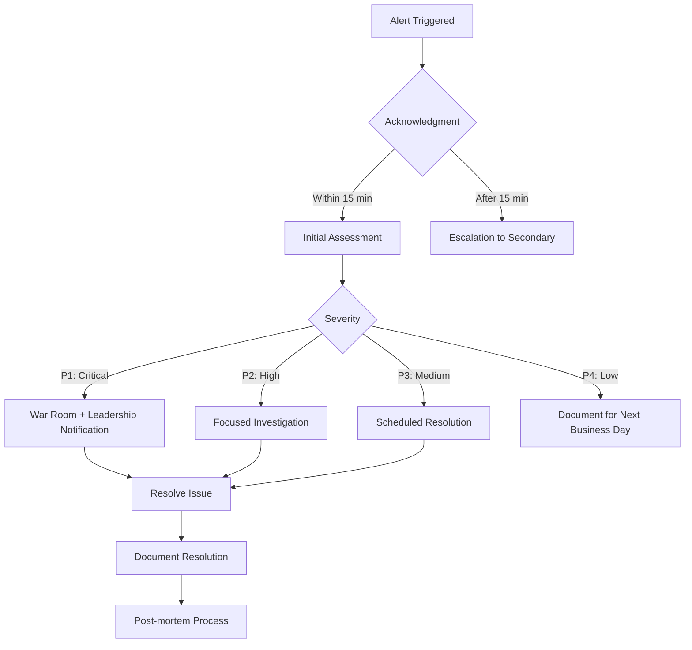
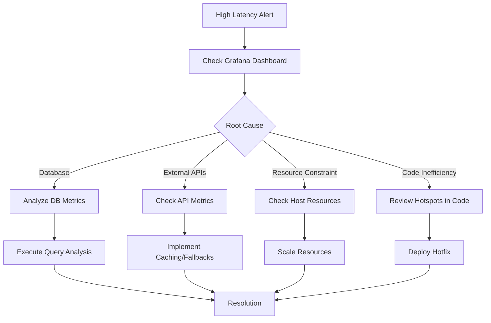
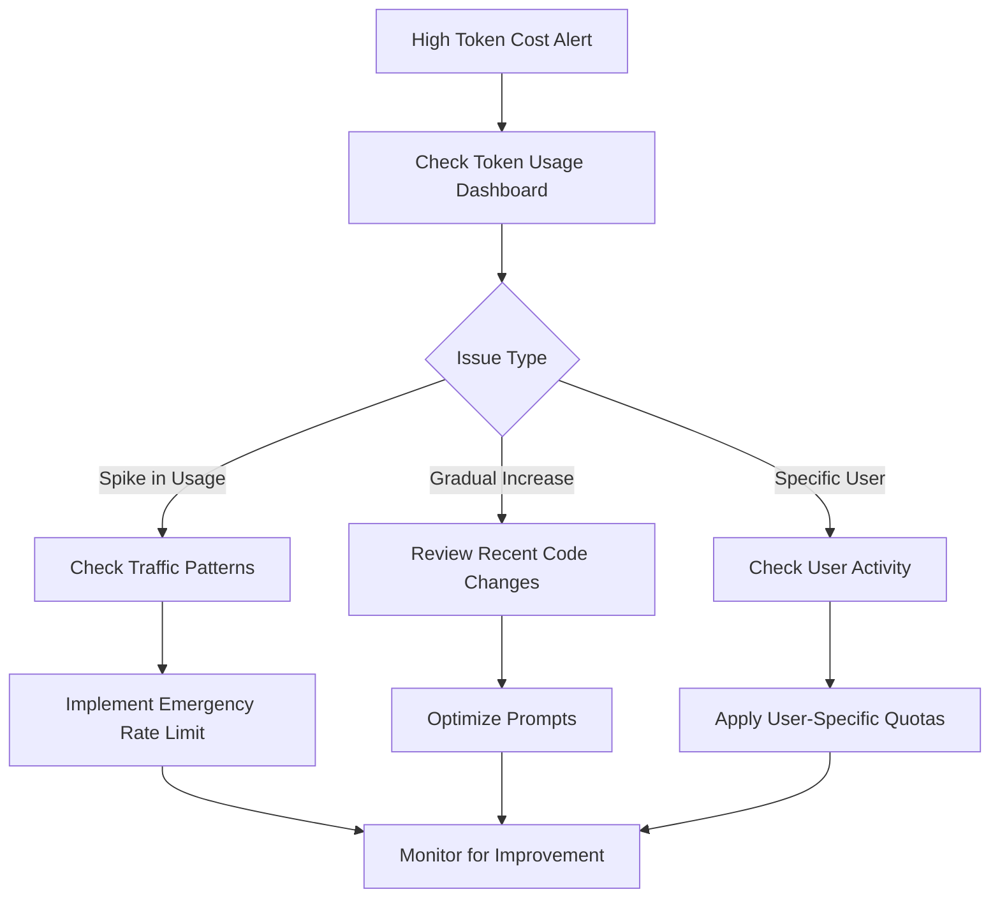
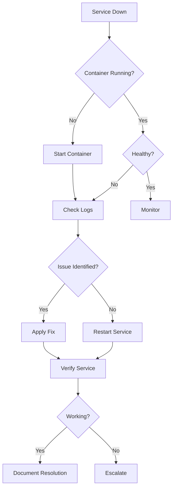

# On-Call Playbook for AI.VC Platform

This document provides guidance for on-call engineers responding to alerts and incidents in the AI.VC platform.

## On-Call Responsibilities

As an on-call engineer, you are responsible for:
1. Responding to alerts within the defined SLA
2. Diagnosing and resolving incidents
3. Communicating status to stakeholders
4. Documenting incidents and resolutions
5. Participating in post-incident reviews

## Incident Response Process



## Severity Levels

| Level | Description | Response Time | Resolution Time | Examples |
|-------|-------------|--------------|-----------------|----------|
| P1 | Critical service outage affecting all users | 15 min | 4 hours | DB unavailable, API down |
| P2 | Major functionality impacted for many users | 30 min | 8 hours | High error rates, slow response |
| P3 | Minor functionality impacted | 2 hours | 24 hours | Non-critical feature unavailable |
| P4 | Cosmetic issues or non-urgent bugs | Next business day | Planned | UI glitches, isolated issues |

## Common Alert Types and Resolution Steps

### Service Downtime Alerts

**Alert: ServiceDown**

1. **Initial Assessment**
   - Check if the service container is running: `docker ps | grep <service_name>`
   - Check service logs: `docker logs <container_id>`

2. **Common Causes and Solutions**

   a. **Service Crashed**
   ```bash
   # Restart the service
   docker restart <container_id>
   
   # Check for startup errors
   docker logs --tail 100 <container_id>
   ```

   b. **Memory Issues**
   ```bash
   # Check memory usage
   docker stats
   
   # Increase container memory limit if needed
   docker update --memory 2G <container_id>
   ```

   c. **Dependency Failure**
   - Check if dependent services (DB, Redis, Kafka) are running
   - Check connectivity between services

3. **Escalation Path**
   - If unable to resolve within 30 minutes, escalate to the service owner
   - For database issues, escalate to the DB admin

### High Latency Alerts

**Alert: HighLatency**

1. **Initial Assessment**
   - Check service logs for slow operations
   - Check Prometheus metrics for bottlenecks
   - Examine Jaeger traces for slow spans

2. **Common Causes and Solutions**

   a. **Database Bottlenecks**
   ```bash
   # Check slow queries
   docker exec -it postgres psql -U postgres -c "SELECT * FROM pg_stat_activity WHERE state = 'active' ORDER BY query_start ASC;"
   
   # Check database connections
   docker exec -it postgres psql -U postgres -c "SELECT count(*) FROM pg_stat_activity;"
   ```

   b. **Resource Contention**
   - Check CPU, memory, and disk usage on host
   - Consider scaling the service horizontally

   c. **External Service Dependencies**
   - Check latency to external services (OpenAI, etc.)
   - Look for timeouts or connection pooling issues

3. **Temporary Mitigation**
   - Increase service instances if possible
   - Enable caching where appropriate
   - Consider implementing circuit breakers



### High Error Rate Alerts

**Alert: HighErrorRate**

1. **Initial Assessment**
   - Check service logs for error patterns
   - Check Grafana dashboards for error spikes
   - Identify affected endpoints or components

2. **Common Causes and Solutions**

   a. **API or Service Failures**
   ```bash
   # Check error logs
   docker logs --tail 100 <container_id> | grep -i error
   
   # Check service health
   curl -v http://<service_host>:<port>/health
   ```

   b. **Data Validation Issues**
   - Look for malformed requests in logs
   - Check input validation logic

   c. **Resource Exhaustion**
   - Check for memory leaks, connection exhaustion
   - Monitor resource usage trends

3. **Mitigation Steps**
   - Deploy last known good version if recent deployment
   - Implement rate limiting if under load
   - Add more detailed logging for diagnosis

### Token Cost Alerts

**Alert: HighTokenCost**

1. **Initial Assessment**
   - Check OpenAI token usage metrics in Grafana
   - Identify which service is consuming tokens
   - Look for unusual patterns or spikes

2. **Common Causes and Solutions**

   a. **Inefficient Prompts**
   - Review recent prompt changes
   - Check for excessive token usage per request

   b. **Unexpected Traffic**
   - Check for unusual request patterns
   - Look for potential misuse or abuse

   c. **Model Configuration**
   - Verify correct model is being used
   - Check temperature and max token settings

3. **Mitigation Steps**
   - Implement stricter rate limits
   - Adjust model parameters to reduce token usage
   - Consider using a smaller model for less critical tasks



## Database Issues

### PostgreSQL Troubleshooting

1. **Connection Issues**
   ```bash
   # Check if PostgreSQL is running
   docker ps | grep postgres
   
   # Check connection count
   docker exec -it postgres psql -U postgres -c "SELECT count(*) FROM pg_stat_activity;"
   
   # Check for connection errors
   docker logs postgres | grep -i "connection"
   ```

2. **Performance Issues**
   ```bash
   # Find slow queries
   docker exec -it postgres psql -U postgres -c "SELECT pid, now() - query_start AS duration, query FROM pg_stat_activity WHERE state = 'active' ORDER BY duration DESC LIMIT 10;"
   
   # Check table sizes
   docker exec -it postgres psql -U postgres -c "SELECT pg_size_pretty(pg_total_relation_size(relid)) AS total_size, pg_size_pretty(pg_relation_size(relid)) AS data_size, relname FROM pg_catalog.pg_statio_user_tables ORDER BY pg_total_relation_size(relid) DESC LIMIT 10;"
   ```

3. **Deadlocks**
   ```bash
   # Check for deadlocks
   docker exec -it postgres psql -U postgres -c "SELECT blocked_locks.pid AS blocked_pid, blocked_activity.usename AS blocked_user, blocking_locks.pid AS blocking_pid, blocking_activity.usename AS blocking_user, blocked_activity.query AS blocked_statement, blocking_activity.query AS blocking_statement FROM pg_catalog.pg_locks blocked_locks JOIN pg_catalog.pg_stat_activity blocked_activity ON blocked_activity.pid = blocked_locks.pid JOIN pg_catalog.pg_locks blocking_locks ON blocking_locks.locktype = blocked_locks.locktype AND blocking_locks.DATABASE IS NOT DISTINCT FROM blocked_locks.DATABASE AND blocking_locks.relation IS NOT DISTINCT FROM blocked_locks.relation AND blocking_locks.page IS NOT DISTINCT FROM blocked_locks.page AND blocking_locks.tuple IS NOT DISTINCT FROM blocked_locks.tuple AND blocking_locks.virtualxid IS NOT DISTINCT FROM blocked_locks.virtualxid AND blocking_locks.transactionid IS NOT DISTINCT FROM blocked_locks.transactionid AND blocking_locks.classid IS NOT DISTINCT FROM blocked_locks.classid AND blocking_locks.objid IS NOT DISTINCT FROM blocked_locks.objid AND blocking_locks.objsubid IS NOT DISTINCT FROM blocked_locks.objsubid AND blocking_locks.pid != blocked_locks.pid JOIN pg_catalog.pg_stat_activity blocking_activity ON blocking_activity.pid = blocking_locks.pid WHERE NOT blocked_locks.GRANTED;"
   ```

## Kafka Issues

1. **Check Broker Status**
   ```bash
   # Check Kafka status
   docker ps | grep kafka
   
   # List topics
   docker exec -it kafka kafka-topics --bootstrap-server localhost:9092 --list
   ```

2. **Consumer Group Issues**
   ```bash
   # List consumer groups
   docker exec -it kafka kafka-consumer-groups --bootstrap-server localhost:9092 --list
   
   # Check consumer group lag
   docker exec -it kafka kafka-consumer-groups --bootstrap-server localhost:9092 --describe --group <group_id>
   ```

## OpenAI API Issues

1. **Rate Limiting**
   - Check for 429 errors in logs
   - Implement exponential backoff
   - Distribute requests across time

2. **Token Limits**
   - Check for 400 errors with token limit messages
   - Reduce prompt size or implement chunking
   - Use more efficient prompting techniques

3. **Service Availability**
   - Check OpenAI status page
   - Implement fallback models or cached responses
   - Set up monitoring for API availability

## Observability Tools

### Prometheus and Grafana

1. **Access Grafana**
   - URL: http://localhost:3000
   - Default credentials: admin/admin

2. **Key Dashboards**
   - Services Overview: Overall system health
   - Token Usage: OpenAI API consumption
   - Database Performance: PostgreSQL metrics

3. **Useful Prometheus Queries**
   ```
   # Service error rate
   sum(rate(http_requests_total{status=~"5.."}[5m])) by (job) / sum(rate(http_requests_total[5m])) by (job)
   
   # 95th percentile latency
   histogram_quantile(0.95, sum(rate(http_request_duration_seconds_bucket[5m])) by (job, le))
   
   # OpenAI token usage
   sum(rate(openai_tokens_total[1h])) by (job)
   ```

### Jaeger Distributed Tracing

1. **Access Jaeger UI**
   - URL: http://localhost:16686

2. **Useful Trace Queries**
   - Filter by service name
   - Filter by operation (endpoint)
   - Sort by duration to find slow traces
   - Look for errors in traces

## Incident Documentation

For each incident, document the following:

1. **Incident Summary**
   - Date and time
   - Duration
   - Severity
   - Affected services
   - Impact on users

2. **Timeline**
   - When the issue was detected
   - Key investigation steps
   - Mitigations applied
   - Resolution time

3. **Root Cause Analysis**
   - What caused the issue
   - Why it wasn't caught earlier
   - Contributing factors

4. **Lessons Learned**
   - What went well
   - What could be improved
   - Action items

## Escalation Path

| Role | When to Contact | Contact Method |
|------|-----------------|----------------|
| Primary On-Call | First responder | Slack, Phone |
| Secondary On-Call | If primary unavailable (15min) | Slack, Phone |
| Service Owner | Service-specific issues (30min) | Slack, Email |
| Database Admin | DB issues (30min) | Slack, Phone |
| DevOps/SRE | Infrastructure issues (30min) | Slack, Phone |
| Engineering Manager | P1 incidents (1hr) | Slack, Phone |
| CTO | Ongoing P1 incidents (2hr) | Phone |

## Recovery Procedures

### Service Recovery



### Database Recovery

1. **Connection Pool Exhaustion**
   ```bash
   # Restart service to reset connections
   docker restart <service_container_id>
   
   # Check for leaked connections
   docker exec -it postgres psql -U postgres -c "SELECT pid, application_name, client_addr, backend_start, state, query FROM pg_stat_activity WHERE datname = 'aivc';"
   
   # Terminate idle connections
   docker exec -it postgres psql -U postgres -c "SELECT pg_terminate_backend(pid) FROM pg_stat_activity WHERE state = 'idle' AND now() - state_change > interval '30 minutes';"
   ```

2. **Disk Space Issues**
   ```bash
   # Check disk space
   docker exec -it postgres df -h
   
   # Analyze database size
   docker exec -it postgres psql -U postgres -c "SELECT pg_size_pretty(pg_database_size('aivc'));"
   
   # Clean up old logs
   docker exec -it postgres bash -c "find /var/log/postgresql -name '*.log' -mtime +7 -delete"
   ```

## Preventative Measures

### Regular Maintenance Tasks

1. **Database Maintenance**
   ```bash
   # Run VACUUM ANALYZE
   docker exec -it postgres psql -U postgres -c "VACUUM ANALYZE;"
   
   # Check for index bloat
   docker exec -it postgres psql -U postgres -c "SELECT schemaname, tablename, indexname, pg_size_pretty(pg_relation_size(indexrelid::regclass)) AS index_size FROM pg_stat_user_indexes ORDER BY pg_relation_size(indexrelid::regclass) DESC LIMIT 10;"
   ```

2. **Log Rotation**
   - Ensure log rotation is configured for all services
   - Monitor disk space usage regularly

3. **Backup Verification**
   - Regularly test database restores
   - Verify backup integrity

### Performance Optimization

1. **Database Indexes**
   - Review explain plans for slow queries
   - Add or adjust indexes as needed

2. **Cache Tuning**
   - Monitor Redis cache hit ratios
   - Adjust TTL values based on usage patterns

3. **Connection Pooling**
   - Configure appropriate pool sizes
   - Monitor connection usage

## Emergency Contacts

| Role | Name | Email | Phone |
|------|------|-------|-------|
| Primary On-Call | [Current Schedule] | oncall@aivc.com | [Phone Number] |
| Database Admin | [Name] | db-admin@aivc.com | [Phone Number] |
| DevOps Lead | [Name] | devops-lead@aivc.com | [Phone Number] |
| CTO | [Name] | cto@aivc.com | [Phone Number] |

## Communication Templates

### Incident Start

```
We are investigating reports of [issue description] affecting [service name].
Impact: [description of user impact]
Started: [time]
Updates will follow as more information becomes available.
```

### Incident Update

```
Update on [issue description]:
Current status: [investigating/identified/implementing fix/verifying]
Latest findings: [brief technical details]
ETA for resolution: [time estimate]
Next update: [time]
```

### Incident Resolution

```
The [issue description] affecting [service name] has been resolved.
Root cause: [brief explanation]
Resolution: [actions taken]
Duration: [start time] to [end time]
We apologize for any inconvenience this may have caused.
```

## Post-Incident Review Process

After each P1 or P2 incident, schedule a post-incident review meeting within 48 hours involving:
1. Incident responders
2. Service owners
3. Engineering leads

The meeting should address:
1. Timeline of events
2. Root cause analysis
3. Effectiveness of response
4. Action items to prevent recurrence
5. Improvements to incident response process

Document findings in the incident report and track action items to completion.